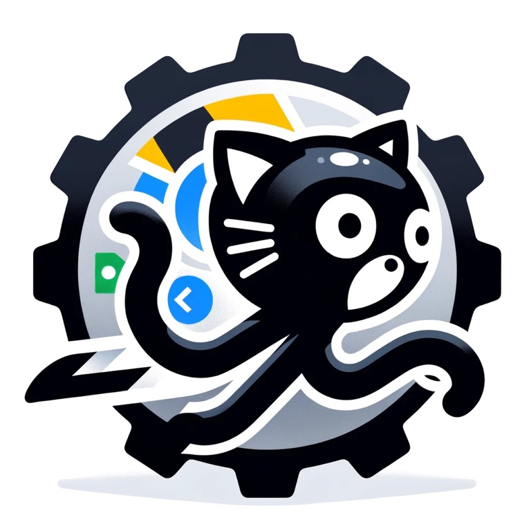

<h1 align="center">
  <br>
  <a href="http:/github.com/prettyirrelevant/gistrunner"></a>
  <br>
  gistrunner
  <br>
</h1>

<h4 align="center">Your go-to 💡 for running 🏃‍♂️ code snippets directly on GitHub Gist!</h4>

<p align="center">
  
  
  
  
</p>

<p align="center">
  <a href="#-features">Features</a> •
  <a href="#-usage">Usage</a> •
  <a href="#-folder-structure">Folder Structure</a> •
  <a href="#-api-documentation">API Documentation</a>
</p>

## 🎯 Features
<sup>[(Back to top)](#--------gistrunner--)</sup>

> **Note:** This is an early stage proof of concept (PoC). It may be buggy or limited. The goal is to demonstrate the possibilities and gauge interest.

### 👨‍💻 Languages

- [ ] C
- [ ] C#
- [ ] C++
- [ ] Zig
- [x] Lua
- [x] Ruby
- [x] Rust
- [x] Julia
- [x] Python
- [x] Golang
- [x] Kotlin
- [x] Javascript
- [x] Typescript

### 🔌 Dependencies

- [ ] Support for packages/dependencies ⏳

### 🖥️ Extension

- [ ] Support gists that are not truncated
- [ ] Add expiry to supported languages cache


## 🤹 Usage <sup>[(Back to top)](#--------gistrunner--)</sup>

### 💻 API
You can use the API directly to run arbitrary code snippets. See the [API docs](#run-code) below for more details.

### 📦 Chrome Extension
🆕 The browser extension is coming soon! Check back for the download link.

🤔 In the meantime, you can load it manually:

1. Clone this repo
2. Go to `chrome://extensions` in your browser
3. Enable "Developer mode"
4. Click "Load unpacked" and select the extension directory
5. Enjoy! 🎉


## 🌵 Folder Structure
<sup>[(Back to top)](#--------gistrunner--)</sup>

```sh
.
├── api (Golang API)
├── docker-daemon (Docker Engine API)
└── extension (Chrome Extension)
```

## 📜 API Documentation
<sup>[(Back to top)](#--------gistrunner--)</sup>

### Run Code
Execute an arbitrary code snippet.

```http
POST /api/run
```

#### Request

```shell
curl --location '/api/run' \
--header 'Content-Type: application/json' \
--data '{
    "content": "package main\nimport \"fmt\"\n\nfunc main() {\n\rfmt.Println(\"Hello, World!\")\n}"
    "language": "golang"
}'
```

#### Response (200)

```text
{
    "code": 200,
    "data": {
        "ID": "gist_kQVHDPvYqBeYMMKdnRDaLm",
        "Hash": "91548d9381c30d715ae7e6ccb7aec0907599c2008497ab289c3b9d970fbf4589",
        "Result": "2024-01-07T09:09:51.636886900Z  Hello, World!\r\n",
        "Language": "golang",
        "CreatedAt": "2024-01-07T10:09:53.012498+01:00",
    },
    "message": "gist ran successfully"
}
```

#### Response (>400)

```text
{
    "code": 500,
    "message": "Oops! Something went wrong on our end"
}
```


### Get statistics

Retrieves total amount of code snippets executed.

```http
GET /api/stats
```

#### Request

```shell
curl --location '/api/stats'
```

#### Response(200)

```json
{
    "code": 200,
    "data": {
        "count": 1
    },
    "message": "Gists count returned successfully"
}
```


### Get supported languages

Retrieves an array of languages that support code execution.

```http
GET /api/languages
```

#### Request

```shell
curl --location '/api/languages'
```

#### Response(200)

```json
{
    "code": 200,
    "data": {
        "golang": ".go",
        "javascript": ".js",
        "julia": ".jl",
        "kotlin": ".kt",
        "lua": ".lua",
        "python": ".py",
        "ruby": ".rb",
        "rust": ".rs",
        "typescript": ".ts"
    },
    "message": "Supported languages returned successfully"
}
```
